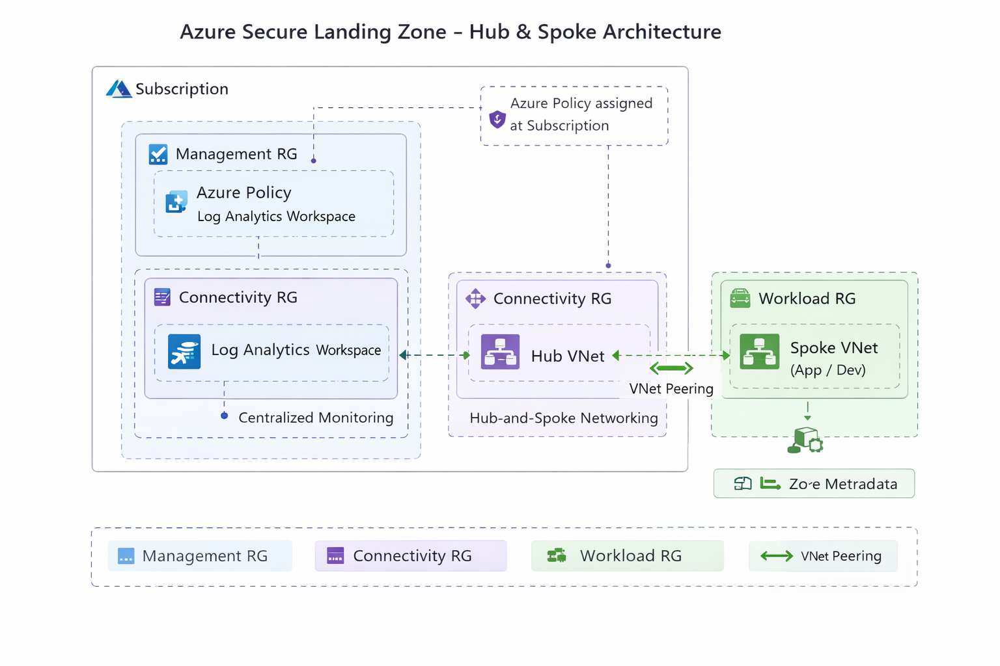

# azure-secure-landing-zone-cli
# Azure Secure Landing Zone (CLI-Based Implementation)

## Overview
This project demonstrates the design and implementation of a **Secure Azure Landing Zone**
aligned with **Microsoft Azure Landing Zone (Enterprise-Scale) architecture principles**.
The solution is deployed using **Azure CLI**, following infrastructure, security, and
governance best practices used in enterprise environments.

This repository serves as a **practical, hands-on proof project** showcasing Azure
Solution Architect–level skills, including governance, networking, security, and monitoring.

---

## Objectives
- Establish a secure and scalable Azure foundation
- Implement governance and compliance using Azure Policy
- Design a hub-and-spoke networking architecture
- Enable centralized monitoring and observability
- Demonstrate Azure CLI–driven deployments with real proof
- Enforce CIS Microsoft Azure Foundations Benchmark using Azure Policy

---

## Architecture Overview
The landing zone follows a **Hub-and-Spoke architecture**:
- **Hub VNet** for shared services and connectivity
- **Spoke VNets** for application and development workloads
- Centralized governance and monitoring

The solution follows a **Hub-and-Spoke architecture** aligned with Microsoft Azure Landing Zone (Enterprise-Scale) best practices.

### Architecture Highlights
- Subscription-level governance using **Azure Policy**
- **Management Resource Group** for centralized Log Analytics
- **Hub VNet** for shared connectivity
- **Spoke VNet** for application workloads
- Secure **VNet peering** between Hub and Spoke

---
## Monitoring & Observability

Centralized monitoring is implemented as part of the Secure Landing Zone to ensure visibility,
auditability, and operational readiness across all environments.

### Log Analytics Workspace
- Central Log Analytics workspace deployed in the **management resource group**
- Workspace serves as a centralized log sink for:
  - Activity logs
  - Diagnostic logs
  - Future workload monitoring
- Retention configured to support audit and compliance requirements

### Design Rationale
- Separates monitoring resources from workload subscriptions
- Aligns with Azure Landing Zone enterprise-scale best practices
- Enables future integration with:
  - Azure Monitor
  - Azure Defender for Cloud
  - Sentinel (SIEM)

### Implementation
- Monitoring resources are deployed using Azure CLI
- Script-based deployment ensures repeatability and consistency

Relevant deployment scripts and validation screenshots are included in the repository.

---
## Security & Governance Baseline (CIS)
This landing zone enforces a security-first governance model using **Azure Policy** aligned with the  
**CIS Microsoft Azure Foundations Benchmark v2.0.0**.

The CIS benchmark is assigned at the **subscription scope** to ensure consistent security controls
are applied across all current and future resources.

### Key Governance Controls
- CIS Microsoft Azure Foundations Benchmark v2.0.0 (built-in initiative)
- Subscription-level policy assignment
- System-assigned managed identity for remediation readiness
- Governance enforced *before* workload deployment (shift-left security)

### Compliance State
- Initial compliance shows **100% (0/0 resources)**, which is expected for a newly provisioned landing zone
- No non-compliant initiatives or policies detected
- Demonstrates proactive governance before onboarding workloads

Evidence of policy assignment and compliance is captured in the `evidence-screenshots/` directory.

## Scope of Implementation
### Included
- Resource group organization (connectivity, management, workloads)
- Hub-and-spoke virtual network topology
- Azure VNet peering
- Azure Policy initiative assignment (CIS Azure Foundations Benchmark)
- Centralized Log Analytics workspace
- Evidence screenshots for validation

### Out of Scope (Future Enhancements)
- Azure Firewall / NVA
- Azure Bastion
- CI/CD automation
- Multi-subscription management group hierarchy

---

## Deployment Approach
All resources are deployed using:
- **Azure CLI (PowerShell)**
- Azure built-in policy initiatives
- Incremental, documented deployment steps

Deployment scripts will be available under `/cli-scripts`.

---
### Monitoring (CLI)

- `04-monitoring-log-analytics.ps1`  
  Deploys a centralized Log Analytics workspace for enterprise monitoring and security insights.

---
### Governance & Compliance (CLI)

- `05b-assign-security-benchmark.ps1`  
  Assigns the CIS Microsoft Azure Foundations Benchmark v2.0.0 at subscription scope using Azure CLI.

---
## Evidence & Validation

| Control | Evidence |
|------|--------|
| Log Analytics Workspace | `evidence-screenshots/04-log-analytics-workspace.png` |
| CIS Policy Assignment | `evidence-screenshots/08-policy-assignment-portal.png` |
| CIS Compliance Status | `evidence-screenshots/09-policy-compliance-cis-baseline.png` |

